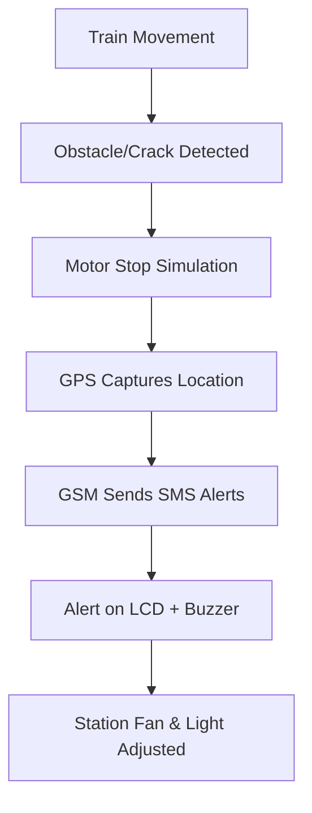

# IoT-Based Smart Railway Safety and Monitoring System

This comprehensive project integrates modern IoT technologies to enhance railway safety, station automation, and energy efficiency. It combines three major functionalities:

- Autonomous Train Obstacle and Crack Detection System  
- Smart Railway Station Platform with IoT Monitoring  
- Smart Parking Gate Control System  

The solution leverages solar and piezoelectric energy harvesting, ultrasonic and IR sensors, GPS-GSM-based live alerting, Wi-Fi data logging via ESP8266, and automated gate control using servo motors to offer a powerful, real-time safety infrastructure.

**Check the visuals on LinkedIn.**
https://tinyurl.com/5n7rfwrh
---

## Key Features

### Autonomous Train Safety System
- Real-time crack and obstacle detection on railway tracks
- GPS-based location tracking of threat areas
- GSM alert system to notify up to three predefined mobile numbers
- LCD message display and audible buzzer alerts
- Motor simulation for emergency train stop
- Dual ultrasonic sensors for obstacle and crack detection

### Smart Railway Station Platform
- Ultrasonic sensors detect approaching trains from both directions
- Automatic platform gate control using servo motors
- DHT11 sensor monitors temperature and humidity
- LDR-based lighting system for night detection
- Fan and light control based on environmental conditions
- Data logging via ESP8266 to ThingSpeak
- LCD display for system status and sensor readings

### Smart Parking Management
- IR or ultrasonic sensor for vehicle detection
- Servo motor-controlled gate for access control
- LCD displays parking availability or gate status
- Integrated with station entry system

---

## Components Used

| Component                         | Quantity |
|----------------------------------|----------|
| Arduino Uno (ATmega328P)         | 2        |
| ESP8266 (NodeMCU)                | 1        |
| Ultrasonic Sensors (HC-SR04)     | 4        |
| GPS Module (NEO-6M or similar)   | 1        |
| GSM Module (SIM800L/SIM900)      | 1        |
| IR Sensors                       | 1–2      |
| Piezoelectric Sensor             | 1        |
| Solar Panel                      | 1        |
| LCD Display (I2C 16x2)           | 1        |
| Servo Motors                     | 2        |
| DHT11 Sensor (Temp & Humidity)   | 1        |
| LDR Sensor                       | 1        |
| Fan and Bulb (for demo)          | 1 each   |
| Rechargeable Battery + Charger   | 1        |
| Breadboard, Jumpers, Resistors   | As needed|

---

## Functional Architecture

### Track Safety Monitoring
- Two ultrasonic sensors detect objects or cracks
- Upon detection:
  - Buzzer is activated and LCD displays an alert
  - Motor halts (simulated train stop)
  - GPS fetches location coordinates
  - GSM sends SMS with Google Maps link

### Station Platform Monitoring
- Ultrasonic sensors monitor train approach
- Servo gate opens when train stops at the platform
- LDR triggers lighting based on ambient light
- DHT11 logs temperature and humidity
- Fan and light are controlled based on thresholds
- ESP8266 pushes data to ThingSpeak dashboard

### Smart Parking Automation
- IR/Ultrasonic sensor detects vehicle
- Servo motor controls gate access
- LCD displays gate status or slot availability

---

## IoT Dashboard Parameters (ThingSpeak)

| Field     | Parameter                     |
|-----------|-------------------------------|
| Field 1   | Light Intensity (LDR)         |
| Field 2   | Train Distance (Right Sensor) |
| Field 3   | Train Distance (Left Sensor)  |
| Field 4   | Humidity (%)                  |
| Field 5   | Temperature (°C)              |

Additional features like crack detection and GPS location can be added using extended fields or a separate dashboard.

---

## Power System

- Hybrid power source combining solar and piezoelectric harvesting  
- Solar panel powers the controller and Wi-Fi module  
- Piezoelectric sensors generate energy from train vibrations  
- Battery backup ensures system works during low solar input  
- Protective diodes prevent reverse current and power loss  

---

## Alert Mechanism Flow

---

## Future Enhancements

- Mobile application interface for railway authorities  
- AI/ML-based prediction and fault detection  
- Real-time train tracking dashboard for passengers  
- Solar-powered fully wireless deployment  
- Voice-enabled alerts at stations  

---

## Notes

- Designed for educational, prototyping, and demonstration purposes  
- Modular design allows deploying individual features independently  
- Code structured using:
  - TinyGPS++
  - NewPing
  - SoftwareSerial
  - LiquidCrystal_I2C

---

## License

This project is open-source and available for academic and research purposes.

Contributions, feedback, and forks are welcome.
